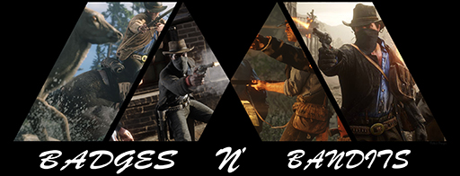

| MASTER | [DEV BRANCH](https://github.com/rhapidfyre/Badges-n-Bandits/tree/dev) |
|---------|--------|
|||

# Badges n' Bandits (BNB)
### A Cops and Robbers Gamemode for [RedM](https://redm.gg/). 

## Description
RedM BNB is a community-developed gamemode for RedM, a modification of Red Dead Redemption 2. In this non-roleplay oriented gamemode, players join, make their character, and spend time either completing legal jobs (mail courier, fishing, etc), illegal jobs (robbery, gun running, etc), or taking the role of law enforcement.

The current version is 0.1d (DEV). [Visit me on discord](http://discord.gg/FRWpsbq) for support, bugs, or development discussion.

## Weekly Update
The master branch will be updated on a weekly basis every Thursday evening at 1PM Pacific (4PM Eastern).
If the dev build is stable, it will be pushed to the master and all changes will be effective immediately.
If the dev build is not stable, critical branches/changes will be rebased into the master.

## Installation
These are very basic instructions to get most people up and running. Your setup may vary.
>1) Clone the latest version of the master branch of this repo
>2) Upload the contents of the `[bb]` folder to your server's resources folder
>3) Move the `bb.cfg` file in the `[bb]` folder to your server's `server.cfg` location
>4) Add `exec bb.cfg` to your `server.cfg` file
>5) Create an SQL database
>6) Download and install GHMattiMySQL
>6b) Change GHMattiMySQL's `__resource.lua` filename to `fxmanifest.lua`
>7) Update MySQL-Async with your database details
>8) Import the `database_v#.sql` file from this repository
>9) Start the Server

You will need to install [GHMattiMySQL](https://github.com/GHMatti/ghmattimysql).

# Development Instructions

## Minimum Requirements
* Each commit needs a brief but detailed description of the contribution
* All resources must have an `fxmanifest.lua` file with a header explaining what the resource is for/does.
* Code that can't be reasonably deceiphered must have appropriate comments
* ==If you want to be credited for your contribution==, edit the `README.md` on the main repo directory (this file)
* All exports and events meant to be used by other resources must have a corresponding README.md file to explain their proper usage, with examples

## Forking & Pull Requests
All working copies will be on the [development branch](https://github.com/rhapidfyre/Badges-n-Bandits/tree/dev). Anyone wishing to contribute should fork the dev branch of the gamemode, create any branches as necessary, and open a pull request when finished.

### Unfinished Pull Requests
If your done working on your contribution for a decent part of time, submit your work to the repo and come back later to finish it. We'd rather allow others to have access to your changes and work on it in the mean time.

### Conflicts
All merge conflicts must be resolved before finalizing your pull request.
Requests with conflicts will not be accepted.

# Contributors / Licensing

# License
This gamemode is unlicensed. Anyone may use, distribute, edit, or otherwise alter these files at any time, or use them for personal development/education. This is an "open source" project.

### Project Manager
[RhapidFyre](https://github.com/rhapidfyre)

### Project Collaborators
Manages the Github Repo/Gamemode Version

### Contributors
Contributed at least once
